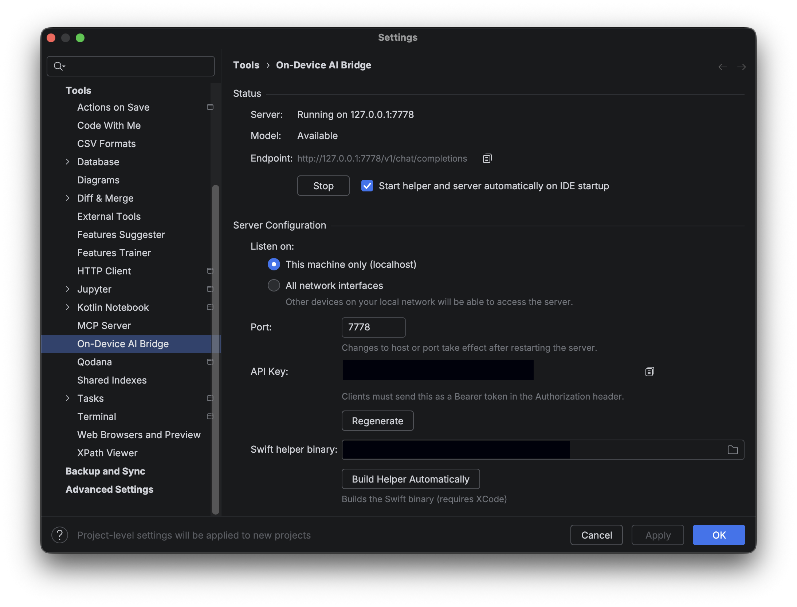

# On-Device AI Bridge

Exposes the on-device AI (FoundationModels) as an OpenAI-compatible REST API for use with Cursor, Continue, or any tool that supports OpenAI endpoints.

<!-- Plugin description -->
Exposes the on-device AI (FoundationModels) as an OpenAI-compatible REST API.
Requires macOS 26+ (Tahoe) with on-device AI enabled and Apple Silicon.
Use with Cursor, Continue, or any tool that supports OpenAI-compatible endpoints.
<!-- Plugin description end -->

## Requirements

- **macOS 26+ (Tahoe)** with Apple Silicon
- On-device AI enabled in System Settings
- Xcode (for building the Swift helper)

## Setup

1. Install the plugin from the [JetBrains Marketplace](https://plugins.jetbrains.com/plugin/dev.sebastiano.plugins.appleintelligence) or build from source
2. Open **Settings → Tools → On-Device AI Bridge**
3. Click **Build Helper Automatically** to build the Swift helper (requires Xcode)
4. Click **Start** to launch the server
5. Optionally enable **Start helper and server automatically on IDE startup** to have it run on every launch

## Usage

Once running, the plugin exposes:

- **Endpoint:** `http://127.0.0.1:8080/v1/chat/completions` (configurable host/port)
- **Models:** `apple-on-device`
- **OpenAI-compatible:** Chat completions (streaming and non-streaming)
- **API Key:** Optionally configure an API key that clients must send as a Bearer token

The server can listen on localhost only (default) or all network interfaces. Configure Cursor, Continue, or other tools to use this endpoint as a local OpenAI-compatible server.

## Android Studio Setup

To use On-Device AI Bridge as a model provider in Android Studio (or other JetBrains IDEs with AI Assistant):

1. **Start the plugin** — Open **Settings → Tools → On-Device AI Bridge**, start the helper, and note the endpoint (e.g. `http://127.0.0.1:8080`).

2. **Add as remote model provider** — Go to **Settings → Tools → AI Assistant → Models & API keys**.

3. **Configure OpenAI-compatible provider:**
   - Under **Third-party AI providers**, select **OpenAI-compatible**
   - **URL:** `http://127.0.0.1:8080` (or your configured host/port; no path needed)
   - **API Key:** Leave blank or use a placeholder (e.g. `no-api-key`) — local endpoints typically do not require authentication
   - Click **Test Connection** to verify, then **Apply**

4. **Assign the model** — In the **Models Assignment** section, set **Core features** (and optionally **Instant helpers**) to **apple-on-device**.

The on-device AI model will then appear in AI Chat and can be used for code generation, chat, and other AI Assistant features.
